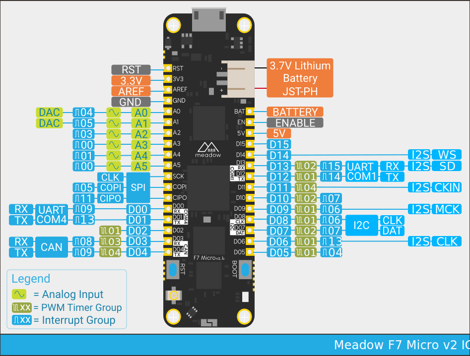

# Embedded Development 

---

# What Is Embedded Development?

* Discipline of software development focused on low level hardware
* Direct integration with hardware
* Usually lower specs than you are used to
* Single function systems
* Real time systems

<!-- 
  * Assembly programming != embedded, OS still handles a lot for you (e.g. virtual memory locations) 
  * Real time deadlines
-->

---
layout: two-cols
---

# Arduino

* Arduino originally created for teaching in 2005
* Low cost and simple tooling stack
* Mostly used in hobbyist space
* Arduinos usually 16Mhz, 2KB RAM

::right::

---
layout: two-cols
---

# ESP32

* ESP32 arrived in 2016
* ARM CPU 160Mhz+, 320KB+ RAM
* Wifi/Bluetooth
* Can be integrated easily in custom PCBs
* 33 Input/Output Pins
* Has several variants with different capabilities

::right::

---

# 8 and 16-Bit Microcontrollers

* Can operate in the low double digit Mhz range
* Lower complexity allows for better specialization of peripheral support
* Extreme reliability
* Very low power consumption
* Used everywhere, from toys to cars to rockets.

---

# What About Raspberry Pi?

* 1Ghz+ CPU / 512MB - 4GB RAM
* Runs Linux
* Not easily integrated into custom hardware
* Normal operating systems are not real time

---

# Peripherals

&nbsp;

---

# Wiring Things Up

&nbsp;

---

# Schematics

---
layout: two-cols
---

# PCB Design

::right::

  

---

# Physical PCBs

---
layout: two-cols
---

# Physical PCBs

::right::
&nbsp;

<video src="/mgpu-active.mp4" type="video/mp4" autoplay loop style="max-height: 400px"></video>

---

# Embedded Programming Languages

* C / C++ are the gold standard
* Rust
* Python
* C#
* Typescript (Microsoft DeviceScript)

---

# The Meadow Microcontroller

* Supports C#
* 216Mhz, 32MB of RAM
* On board wifi and bluetooth
* Visual Studio integration
* Composable abstractions to make Embedded easy
* Over 700 drivers for popular peripherals
* Mostly open source
  * https://github.com/WildernessLabs/

---
layout: two-cols
---

# Blinking an LED
&nbsp;

<video src="/e01demo.mp4" type="video/mp4" autoplay loop></video>

::right::

---

# Inputs and Outputs
&nbsp;

<!--  -->

---
layout: two-cols
---

# Simple I/O Example
&nbsp;

<video src="/e02demo.mp4" type="video/mp4" autoplay loop></video>

::right::

---
layout: two-cols
---

# Simple I/O Example
&nbsp;

<!-- <video src="/e02demo.mp4" type="video/mp4" autoplay loop></video> -->
* Taking better advantage of C# with events!

::right::

---

# Analog Vs Digital Signals
&nbsp;

---
layout: two-cols
---

# Analog Input Example
&nbsp;

<video src="/e03demo.mp4" type="video/mp4" autoplay loop></video>

::right::

---
layout: two-cols
---

# Motor Example
&nbsp;

<video src="/e04demo.mp4" type="video/mp4" autoplay loop></video>

::right::
 

---
layout: two-cols
---

# Seven Segment Displays
&nbsp;

<video src="/e05demo.mp4" type="video/mp4" autoplay loop></video>

::right::

---
layout: two-cols
---

# Extra Functionality

* What if we want more seven segment displays?
* Peripherals to the rescue!

::right::

---
layout: two-cols
---

# How To Communicate With A Peripheral

* Send one bit at a time
* How do we communicate two bits with the same value?

::right::

---
layout: two-cols
---

# How To Communicate With A Peripheral

* Latch pin signals to peripheral it can read
* Peripheral can only trust the value when latch is active
* How do we know when the peripheral has read the bit?
* How do we read a value?

::right::

---
layout: two-cols
---

# How To Communicate With A Peripheral

* Slow and complicated
* Input and output latches not necessarily syncrhonized
* No clear signal on either end to start
* Not scalable to more peripherals

::right::

---
layout: two-cols
---

# Serial Peripheral Interface (SPI)

* MOSI/COPI - Controller Output, Peripheral Input
  * Data to be sent to peripheral
* MISO/CIPO - Controller Input, Peripheral Output
  * Data to be received from peripheral
* CS - Chip Select
  * Specifies which peripheral to talk to
* SCLK - Clock Signal
  * Synchronizes controller and peripeherals

::right:: 

&nbsp;

---

# Multiple SPI Devices

&nbsp;

---
layout: two-cols
---

# I2C

* SDA - Serial Data Line
* SCL - Serial Clock Line
* Many controllers and peripherals with 2 wires
* Each peripheral has a unique address!
  * Controller must know the correct address
* No simultaneous read and write
* Slower than SPI

::right::

---
layout: two-cols
---

# CAN Communication Bus

* Controller Area Network
* Wiring setup used in cars
* Any number of controllers

::right::

 

---

# Debugging
&nbsp;

---
layout: two-cols
---

# Expanding I/O Pins
&nbsp;

<video src="/e06demo.mp4" type="video/mp4" autoplay loop></video>

::right::

---
layout: two-cols
---

# 14 Segment Display
&nbsp;

::right::

--- 
layout: two-cols
---

# Room Sensor Reading
&nbsp;

::right::

---

# What Can You Do?

&nbsp;

<video src="/rolling_game.mp4" type="video/mp4" autoplay loop style="max-height:400px" ></video>

---

# What Can You Do?

---

# What Can You Do?

&nbsp;

---

# Thank You